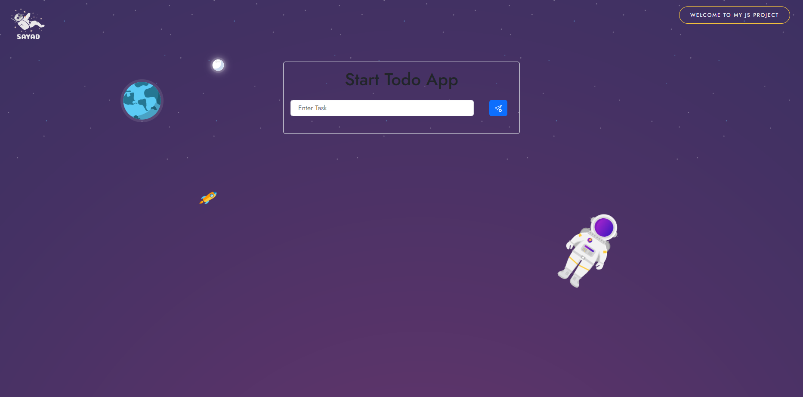

# space js ToDo ⭐

Space JS ToDo is a simple web-based todo list application built with HTML, CSS, and JavaScript. It provides a minimalistic interface for managing your tasks efficiently.

## Features

- **Add and Remove Tasks:** Easily add new tasks to your todo list and remove them when completed.
- **Mark Tasks as Complete:** Mark tasks as complete by checking them off from the list.
- **Persistent Storage:** Your todo list is saved locally in the browser's storage, ensuring your tasks are preserved even after refreshing the page.
- **Responsive Design:** The application is responsive and works seamlessly across different devices and screen sizes.

## Live Demo

Check out the live demo of Space JS ToDo [here](https://abdulrahim-ramadan.github.io/space-js-ToDo/).

## Screenshots



## Usage

1. **Clone the Repository:**

   ```bash
   git clone https://github.com/abdulrahim-ramadan/space-js-ToDo.git
   ```

2. **Open `index.html` in Your Browser:**

   Navigate to the project directory and open the `index.html` file in your preferred web browser to start using the application.

3. **Add and Manage Tasks:**

   - To add a new task, type the task in the input field and press Enter.
   - To mark a task as complete, click on the checkbox next to the task.
   - To remove a task, click on the delete button next to the task.

## Contributing

Contributions are welcome! If you have any ideas, suggestions, or bug fixes, please open an issue or submit a pull request.

## License

This project is licensed under the [MIT License](LICENSE).


#Please ⭐ the repo to support our project
